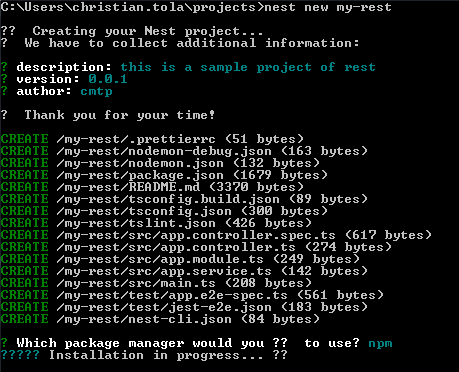
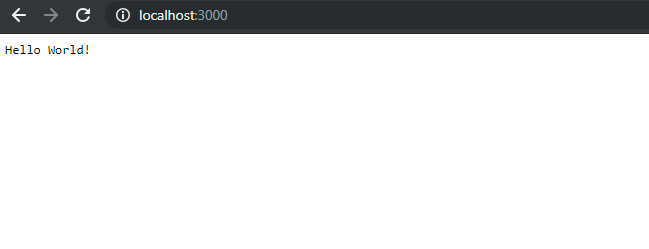

<WebImage name="banners/BannerTemplateNode.jpg" alt="create api rest nest"/>

Node.js es un entorno de programación que permite crear aplicaciones en el lado del servidor utilizando Javascript como lenguaje principal, esto ha generado mucha popularidad entre los desarrolladores ya que permite desarrollar una aplicación en todos sus niveles (Base de datos, Backend, Frontend) con Javascript.

[Nest.js](https://nestjs.com/) es un Framework para el desarrollo Backend que permite crear aplicaciones del lado del servidor utilizando Typescript.


Nest.js utiliza un sistema de anotaciones para abstraer muchas de las configuraciones que se necesitan para crear un servidor rest, un servidor Graphql, o un WebSocket, permitiéndonos centrarnos mas en el código directamente.

Si anteriormente ya hemos trabajado con Java para el desarrollo de aplicaciones web, Nest.js es un Framework muy parecido a [Spring Boot](https://spring.io/), ambos se basan en un sistema de anotaciones para las configuraciones, su sistema de inyección de dependencias esta inspirado en Angular y permite modularizar la aplicación de tal forma que podemos crear módulos para diferentes secciones de nuestra aplicación.

La [documentación](https://docs.nestjs.com/) oficial es muy completa e intuitiva, y contiene una gran variedad de ejemplos sobre las funcionalidades que se pueden desarrollar con Nest.js

## Instalación

La mejor forma de iniciar un proyecto con Nest.js es instalando su interfaz de linea de comandos, para instalar Nest.js utilizaremos el siguiente comando:

```bash
# Para sistemas operativos Mac o Linux agregar sudo por delante para realizar la instalación como super usuario.
npm install -g @nestjs/cli
```

para verificar que la instalación fue satisfactoria ejecutamos el comando:

```bash
nest --version
```

eso nos mostrara la version del nest cli que tenemos instalada.

para comenzar un nuevo proyecto ejecutamos el siguiente comando:

```bash
nest new my-rest
```

Nest nos solicitara una descripción, la version del proyecto y el autor del mismo, luego creara un nuevo proyecto llamado *my-rest* con toda la estructura inicial que necesitamos para comenzar.



Si dentro del proyecto creado ejecutamos **npm run start:dev** nest compilara nuestro proyecto y levantara el servidor de desarrollo, el comando **start:dev** levanta el servidor de desarrollo y también nos permite realizar el *hot reloading*, cuando cambiemos cualquier fichero de nuestro servidor, este se refrescara.

Ahora si accedemos en el browser a la url [http://localhost:3000](http://localhost:3000) veremos el mensaje *Hello World!* que nos confirma que nuestro proyecto esta funcionando correctamente.



En la nueva estructura de archivos que se creara la carpeta **src** es la carpeta mas importante de nuestra aplicación, es ahi donde se escribirá todo el código de nuestra aplicación.

Dentro de la carpeta **src** Nest.js generó los siguientes archivos: 
- **app.controller.ts**, el controlador(controller) de la aplicación.
- **app.controller.spec.ts** , el archivo de test para el controller.
- **app.service.ts**, un servicio que es donde se ejecutaran operaciones dentro del servidor.
- **app.module.ts**, el archivo del modulo principal, Al igual que [Angular](https://angular.io), Nest nos permite trabajar con una arquitectura modular.
- **main.ts**, el punto de acceso de nuestra aplicación.

para comenzar con nuestro ejemplo generaremos toda la estructura que necesitaremos desde la terminal utilizando el nest-cli, primeramente generaremos nuestro modulo al cual llamaremos como *contact*

```bash
# es posible usar --dry-run para verificar los cambios antes de ejecutarlos.
nest generate module contact
```

Esto agregara un nuevo folder llamado contact y dentro el archivo contact.module.ts, al mismo tiempo el modulo contact sera importado por el modulo principal, seguidamente dentro del modulo contact generaremos un servicio y un controller:

```bash
# generar controller
nest generate controller contact 
# generar service
nest generate service contact 
```

**Nota:** Si el modulo contact no se hubiera generado antes de el controller y el servicio, tendríamos que manualmente importarlos dentro del modulo contact y quitarlos del modulo principal, de esta manera aseguramos que nuestro modulo *contact* se encargue de todo lo relacionado a contact dentro de nuestra aplicación.

Una vez tengamos nuestro modulo creado crearemos una interfaz *contact* y una clase llamada *CreateContactDto*, esto podemos hacerlo desde el cli:

```bash
# generar una interfaz dentro del folder contact/interfaces
nest generate interface contact/interfaces/contact
# generar una clase dentro del folder contact/dto
nest generate class contact/interfaces/CreateContactDto
```

Ahora que tenemos todos los archivos necesarios para nuestra aplicación, comenzaremos por modificar nuestra interfaz y nuestro dto, nuestra interfaz *contact* tendrá el siguiente contenido en el archivo **contact.interface.ts**:

```ts
export interface Contact {
  id: string;
  name: string;
  lastName: string;
  age: number;
  phone: number;
}
```

lo mismo para nuestra clase *CreateContactDto* en el archivo **create-contact-dto.ts**:

```ts
export class CreateContactDto {
  name: string;
  lastName: string;
  age: number;
  phone: number;
}
```

Utilizaremos la interface *Contact* como el tipo de objetos con el que interactuaremos con nuestro api rest. al cual accederemos por medio de nuestro *ContactController*, primeramente modificaremos nuestro *contact.service.ts* para agregar todas las operaciones que podremos realizar, en siguientes ejemplos utilizaremos una base de datos ya sea **SQL** o **NoSQL**, pero de momento utilizaremos un arreglo del tipo *Contact* para almacenar la información de nuestros contactos:

```ts
...
@Injectable()
export class ContactService {
  contacts: Contact[] = [];
  ...
}
```

Luego crearemos un método que nos permite retornar el valor del arreglo, y otro que permita agrega un nuevo elemento al arreglo, aquí es donde utilizaremos un objeto del tipo *CreateContactDto* como parámetro de nuestro método, para generar el id de cada contacto, utilizaremos la librería [uuid](https://www.npmjs.com/package/uuid) que nos permitirá generar un id único para cada contacto.

```bash
# instalar uuid
npm install --save uuid
```
```ts
...
import { CreateContactDto } from './dto/create-contact-dto';
import { Contact } from './interfaces/contact.interface';
import * as uuidv4 from 'uuid/v4';

@Injectable()
export class ContactService {
  contacts: Contact[] = [];
  
  getContacts(): Contact[] {
    return this.contacts;
  }

  saveContact(contact: CreateContactDto): Contact {
    let newContact = {
      id: uuidv4(),
      name: contact.name,
      lastName: contact.lastName,
      age: contact.age,
      phone: contact.phone,
    };
    this.contacts.push(newContact);
    return newContact;
  }
}
```

Ya tenemos nuestro servicio que nos permite guardar un contacto, y mostrar la lista de los contactos guardados, ahora podemos modificar nuestro **contact.controller.ts**:

```ts
import { Controller, Get, Post, Body} from '@nestjs/common';
import { ContactService } from './contact.service';
import { CreateContactDto } from './dto/create-contact-dto';
import { Contact } from './interfaces/contact.interface';

@Controller('contacts')
export class ContactController {
  constructor(private readonly contactService: ContactService) {}

  @Get()
  getContacts(): any[] {
    return this.contactService.getContacts();
  }

  @Post()
  create(@Body() contact: CreateContactDto): Contact {
    return this.contactService.saveContact(contact);
  }
}

```

Como podemos ver la anotación **@Controller('contacts')** nos da a entender que esta clase es el punto de acceso para el controller llamado *contacts*, para agregar las respectivas urls de cada servicio utilizamos las anotaciones **@Get()** y **@Post()** en los métodos getContacts() y create() respectivamente, y a su vez los métodos llaman a los métodos definidos dentro de las funciones, esto permite separar la implementación y mantener la lógica propia de los controller separada de la lógica que accede a la base de datos.

Es posible que tengamos problemas al trabajar ya con base de datos debido al tiempo que tarda en retornar los servicios, pero Nest.js nos permite trabajar con ello de manera asíncrona utilizando **async/await**.

para ello modificamos nuestro controller y nuestro servicio de la siguiente forma:

```ts
// contact.service.ts
...
@Injectable()
export class ContactService {
  ...
  async getContacts(): Promise<Contact[]> {
    return this.contacts;
  }

  async saveContact(contact: CreateContactDto): Promise<Contact> {
    let newContact = {
      ...
    };
    ...
    return newContact;
  }
}
// contact.controller.ts
...
@Controller('contacts')
export class ContactController {
  ...
  @Get()
  async getContacts(): Promise<Contact[]> {
    return this.contactService.getContacts();
  }

  @Post()
  async create(@Body() contact: CreateContactDto): Promise<Contact> {
    return this.contactService.saveContact(contact);
  }
}

```

De esta manera podremos trabajar de manera asíncrona.

Finalmente aca tenemos nuestros **contact.service.ts** y **contact.controller.ts** completo.

```ts
import { Injectable } from '@nestjs/common';
import { CreateContactDto } from './dto/create-contact-dto';
import { Contact } from './interfaces/contact.interface';
import * as uuidv4 from 'uuid/v4';
import { log } from 'console';

@Injectable()
export class ContactService {
  contacts: Contact[] = [];

  async getContact(id: string): Promise<Contact> {
    log(id);
    let contact = this.contacts.find(item => {
      return item.id === id;
    });
    return contact;
  }

  async getContacts(): Promise<Contact[]> {
    return this.contacts;
  }

  async saveContact(contact: CreateContactDto): Promise<Contact> {
    let newContact = {
      id: uuidv4(),
      name: contact.name,
      lastName: contact.lastName,
      age: contact.age,
      phone: contact.phone,
    };
    this.contacts.push(newContact);
    return newContact;
  }

  async editContact(
    id: string,
    editContact: CreateContactDto,
  ): Promise<Contact> {
    let contact: Contact = null;
    this.contacts.forEach(item => {
      if (item.id === id) {
        item.name = editContact.name;
        item.lastName = editContact.lastName;
        item.phone = editContact.phone;
        item.age = editContact.age;
        contact = item;
      }
    });
    return contact;
  }

  async deleteContact(id: string): Promise<boolean> {
    let pos = 0;
    let res = false;
    this.contacts.forEach((item, index) => {
      if( item.id === id) {
        pos = index;
        res = true;
      }
    });
    this.contacts.splice(pos, 1);
    return res;
  }
}
```

```ts
import {
  Controller,
  Get,
  Post,
  Put,
  Delete,
  Param,
  Body,
} from '@nestjs/common';
import { ContactService } from './contact.service';
import { CreateContactDto } from './dto/create-contact-dto';
import { Contact } from './interfaces/contact.interface';

@Controller('contacts')
export class ContactController {
  constructor(private readonly contactService: ContactService) {}

  @Get()
  async getContacts(): Promise<any[]> {
    return this.contactService.getContacts();
  }

  @Get(':id')
  async getContact(@Param('id') id): Promise<Contact> {
    return this.contactService.getContact(id);
  }

  @Post()
  async create(@Body() contact: CreateContactDto): Promise<Contact> {
    return this.contactService.saveContact(contact);
  }

  @Put(':id')
  async editContact(
    @Param('id') id,
    @Body() contact: CreateContactDto,
  ): Promise<Contact> {
    return this.contactService.editContact(id, contact);
  }

  @Delete(':id')
  async deleteContact(@Param('id') id): Promise<boolean> {
    return this.contactService.deleteContact(id);
  }
}
```

ejecuta **npm run start:dev** para levantar el proyecto y puedes probar las urls utilizando [Postman](https://www.getpostman.com/).


Puedes encontrar mas información sobre nestjs en su [documentación oficial](https://docs.nestjs.com).

El código de ejemplo se encuentra en [github](https://github.com/cmtp/nest-api-rest/tree/api-rest-sample), recuerda instalar las dependencias y ejecutar el proyecto para probarlo:

```bash
git clone git@github.com:cmtp/nest-api-rest.git
cd nest-api-rest
npm install
npm run start:dev
```

**Compártelo en tus redes Sociales!**
<SocialButtons />

<Disqus />