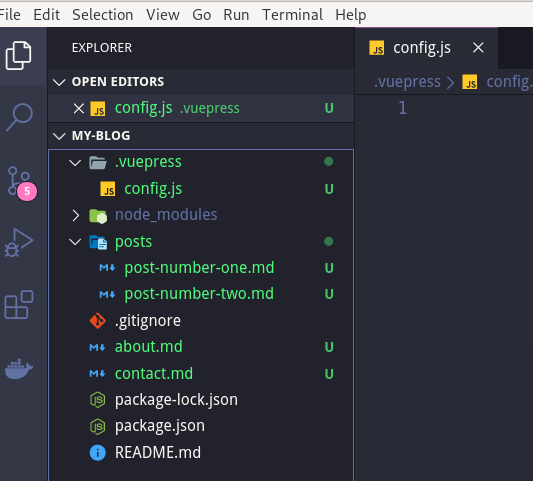

<WebImage name="banners/BannerTemplateVuePress.jpg" alt="Config Routing"/>

En este segundo artículo sobre vuepress, veremos el manejo de rutas y el archivo de configuración con vuepress.

Como vimos en el anterior [post](/blog/create-vuepress-blog.html), para escribir la página de nuestro blog agregamos un archivo **README.md** que se renderiza como la raíz de nuestro sitio (o nuestro _index.html_), pero ¿qué pasa si necesito agregar nuevas rutas?, la respuesta está en la forma de como vuepress estructura sus archivos.

## Estructura de Archivos

Un Proyecto en vuepress tiene la siguiente estructura.

```md
.
├── .vuepress (Opcional)
│ ├── components (Opcional)
│ ├── theme (Opcional)
│ │ └── Layout.vue
│ ├── public (Opcional)
│ ├── styles (Opcional)
│ │ ├── index.styl
│ │ └── palette.styl
│ ├── templates (Opcional, Danger Zone)
│ │ ├── dev.html
│ │ └── ssr.html
│ ├── config.js (Opcional)
│ └── enhanceApp.js (Opcional)
│
├── README.md
├── contact
│ └── README.md
├── about
│ └── README.md
│
└── package.json
```

Tenemos un folder llamado **.vuepress** que es donde guardaremos todos los archivos de configuración, que necesitamos para darle más funcionalidad a nuestro blog, recordemos que nuestro blog está basado en vue.js y podemos crear y utilizar [Vue Components](https://vuejs.org/v2/guide/components.html).

Fuera de la carpeta de configuración _.vuepress_ se encuentra todo el contenido de nuestra aplicación:

```md
│
├── README.md
├── contact.md
├── about.md
├── posts
│ └── README.md
│ └── post-number-one.md
│ └── post-number-two.md
├──
```
<!-- more -->
Nuestra estructura de archivos nos ayudara a crear rutas de manera sencilla siguiendo las siguientes reglas:

1.  Los archivos _README.md_ equivalen a la ruta _"/"_ en nuestro proyecto
2.  todos los folders se renderizan como rutas relativas.
3.  Los archivos que acaben con la extensión _.md_ serán renderizados a _.html_

El archivo **README.md** en la raíz de nuestro proyecto, se convierte en nuestra página de inicio de nuestro blog.

Aca algunos ejemplos:

| Path Relativo               | Rutas                         |
| --------------------------- | ----------------------------- |
| `/README.md`                | `/`                           |
| `/contact.md`               | `/contact.html`               |
| `/about.md`                 | `/about.html`                 |
| `/posts/`                   | `/posts/`                     |
| `/posts/post-number-one.md` | `/posts/post-number-one.html` |
| `/posts/post-number-two.md` | `/posts/post-number-two.html` |

Podemos agregar todas las rutas que necesitemos siguiendo esta estructura, pero ¿Como podemos acceder a nuestras rutas desde nuestro blog sin necesidad de modificar la URL?, utilizaremos el archivo de configuración.

## Archivo de Configuración

Vuepress nos provee un sitio con la mínima configuración y funcional, pero si necesitamos agregar funcionalidades, nos provee un [archivo de configuración](https://vuepress.vuejs.org/guide/basic-config.html#config-file), con el que podemos agregar funcionalidades adicionales.

### Agregando configuraciones

Creamos el folder **.vuepress** en la raíz de nuestro proyecto, y dentro crearemos el archivo **config.js**



En este archivo de configuración agregaremos el título en la barra de navegación.

```js
// .vuepress/config.js
module.exports = {
  title: "My Blog",
  description: "This is a test of my blog",
};
```


Recordemos que vuepress nos provee un tema por defecto que nos simplifica el trabajo, podemos agregar configuraciones específicas para este tema que nos permita agregar enlaces al menú de navegación, agregaremos **"/contact"** y **"/about"** al menú de navegación.

```js
module.exports = {
  ...
  themeConfig: {
    nav: [
      { text: 'Home', link: '/' },
      { text: 'Contact', link: '/contact' },
      { text: 'About Me', link: '/About' }
    ]
  }
}
```


Puede revisar todas las configuraciones [aquí](https://vuepress.vuejs.org/config/#basic-config)

Con estos conocimientos es posible agregar rutas a nuestro sitio web, y agregar otras funcionalidades por medio de configuraciones, en siguientes tutoriales veremos cómo integrar vue components.

He agregado un repositorio con el código usado para crear nuestro blog, puedes revisarlo en este repositorio de [github](https://github.com/cmtp/vuepress-blog/tree/v0.0.2).

Si crees que este contenido puede ser relevante para otras personas además de ti ¡compártelo!

¡Saludos!

**¡Compártelo en tus redes Sociales!**
<SocialButtons />

<Disqus />
